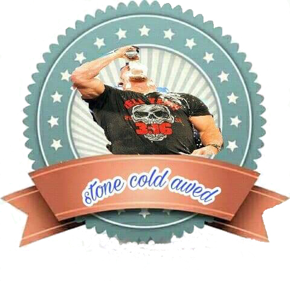
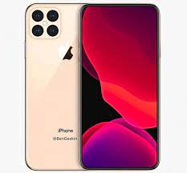

<!DOCTYPE html>
<html lang="en">
  <head>
    <meta charset="UTF-8" />
    <meta http-equiv="X-UA-Compatible" content="IE=edge" />
    <meta name="viewport" content="width=device-width, initial-scale=1.0" />
    <title> Template </title>
    <!-- Main Template CSS File -->
    <link rel="stylesheet" href="css/style.css" />
    <!-- Render All Elements Normally -->
    <link rel="stylesheet" href="css/normalize.css" />
    <!-- Font Awesome Library -->
    <link rel="stylesheet" href="css/all.min.css" />
    <!-- Google Fonts -->
    <link rel="preconnect" href="https://fonts.gstatic.com" />
    <link
      href="https://fonts.googleapis.com/css2?family=Work+Sans:wght@200;300;400;500;600;700;800&#038;display=swap"
      rel="stylesheet"
    />
  </head>
  <body>
    <!-- star hader -->
    <header>
      

        
        <nav>
          <i class="fas fa-bars toggle-menu"></i>
          <ul>
            <li><a class="active" href="#">Home</a></li>
            <li><a href="#">Services</a></li>
            <li><a href="#">Portfolio</a></li>
            <li><a href="#">About</a></li>
            <li><a href="#">Pricing</a></li>
            <li><a href="#">Contact</a></li>
          </ul>
          

            <i class="fas fa-search"></i>
          

        </nav>
      

    </header>
    <!--end hader-->
    <!--start landing-->
    

        

        

          

            <h2>
              Hello World! 
              We Are Kasper We Make Art.
            </h2>
            

              Curabitur arcu erat, accumsan id imperdiet et, porttitor at sem. Mauris blandit aliquet elit, eget tincidunt
              nibh pulvinar a. Curabitur aliquet quam. Accumsan id imperdiet et, porttitor at sem. Mauris blandit aliquet
              elit, eget tincidunt.
            

          

      

      <i class="fas fa-angle-left change-background fa-2x"></i>
      <i class="fas fa-angle-right change-background fa-2x"></i>
      <ul class="bullets">
        <li></li>
        <li class="active"></li>
        <li></li>
      </ul>
    

    <!--end landing-->
 <!-- Start Services -->
 

  

    

      <h2>Services</h2>
      

        Curabitur arcu erat, accumsan id imperdiet et, porttitor at sem. Mauris blandit aliquet elit, eget
        tincidunt.
      

    

 
    

      

        <i class="fas fa-fish fa-3x"></i>

        

          <h3>Vorem amet intuitive</h3>
          

            Curabitur arcu erat, accumsan id imperdiet et, porttitor at sem. Mauris blandit aliquet elit, eget
            tincidunt nibh pulvinar a. Curabitur aliquet quam.
          

        

      

      

        <i class="fas fa-cog fa-3x"></i>
        

          <h3>Vorem amet intuitive</h3>
          

            Curabitur arcu erat, accumsan id imperdiet et, porttitor at sem. Mauris blandit aliquet elit, eget
            tincidunt nibh pulvinar a. Curabitur aliquet quam.
          

        

      

      

        <i class="fas fa-pencil-ruler fa-3x"></i>
        

          <h3>Vorem amet intuitive</h3>
          

            Curabitur arcu erat, accumsan id imperdiet et, porttitor at sem. Mauris blandit aliquet elit, eget
            tincidunt nibh pulvinar a. Curabitur aliquet quam.
          

        

      

      

        <i class="fas fa-camera fa-3x"></i>
        

          <h3>Vorem amet intuitive</h3>
          

            Curabitur arcu erat, accumsan id imperdiet et, porttitor at sem. Mauris blandit aliquet elit, eget
            tincidunt nibh pulvinar a. Curabitur aliquet quam.
          

        

      

    

  

    <!-- End Services -->
    
    <!--start design-->
    

      

        
      

      

        <h2>Our Design Comes With...</h2>
        <ul>
          <li>Responsive Design</li>
          <li>Modern And Clean Design</li>
          <li>Clean Code</li>
          <li>Browser Friendly</li>
        </ul>
      

    

 <!-- Start Portfolio -->
 

  

    

      <h2>Portfolio</h2>
      

        Curabitur arcu erat, accumsan id imperdiet et, porttitor at sem. Mauris blandit aliquet elit, eget
        tincidunt.
      

    

    <ul class="shuffle">
      <li class="active">All</li>
      <li>App</li>
      <li>Photo</li>
      <li>Web</li>
      <li>Print</li>
    </ul>
  

  

    

      
      

        <h4>Awesome Image</h4>
        
Photography

      

    

    

      
      

        <h4>Awesome Image</h4>
        
Photography

      

    

    

      
      

        <h4>Awesome Image</h4>
        
Photography

      

    

    

      
      

        <h4>Awesome Image</h4>
        
Photography

      

    

    

      
      

        <h4>Awesome Image</h4>
        
Photography

      

    

    

      
      

        <h4>Awesome Image</h4>
        
Photography

      

    

    

      
      

        <h4>Awesome Image</h4>
        
Photography

      

    

    

      
      

        <h4>Awesome Image</h4>
        
Photography

      

    

  

  <a href="#" class="more">More</a>

<!-- End Portfolio -->
 <!-- Start vido -->
 

  <video autoplay muted loop>
    <source src="photo/----(MP4).mp4" type="video/mp4">
  </video>
  

    <h2>super Awesome video</h2>
    
it's all you need

    <button>see more</button>
  

 

 <!-- end vido -->
 <!-- start about -->
 

  

    

      <h2>Portfolio</h2>
      

        Curabitur arcu erat, accumsan id imperdiet et, porttitor at sem. Mauris blandit aliquet elit, eget
        tincidunt.
      

    

    
    

 

 <!-- end about -->
    <!-- Start Skills -->
    

      

        

          <h3>Testimonials</h3>
          

            Curabitur arcu erat, accumsan id imperdiet et, porttitor at sem. Mauris blandit aliquet elit, eget
            tincidunt.
          

          

            
            

              Curabitur arcu erat, accumsan id imperdiet et, porttitor at sem. Mauris blandit aliquet elit, eget
              tincidunt.
              
John Doe, CEO

            

          

          

            
            

              Curabitur arcu erat, accumsan id imperdiet et, porttitor at sem. Mauris blandit aliquet elit, eget
              tincidunt.
              
John Doe, CEO

            

          

       
        

        

          <h3>Skills</h3>
          

            Curabitur arcu erat, accumsan id imperdiet et, porttitor at sem. Mauris blandit aliquet elit, eget
            tincidunt.
          

          

            <h4>Adobe</h4>
            

              
            

          

          

            <h4>Html &amp; Css</h4>
            

              
            

          

          

            <h4>JavaScript</h4>
            

              
            

          

          

            <h4>Php</h4>
            

              
            

          

        

      

    

    <!-- End Skills -->
    <!-- start quote -->
    

      

        <q>accumsan id imperdiet et, porttitor at sem. Mauris blandit aliquet elit, eget tincidunt.</q>
        John Doe
      

    

    <!-- end quote -->
 <!-- Start Pricing -->
 

  

    

      <h2>Pricing</h2>
      

        Curabitur arcu erat, accumsan id imperdiet et, porttitor at sem. Mauris blandit aliquet elit, eget
        tincidunt.
      

    

    

      

        

          <h3>Basic</h3>
          19
        

        <ul>
          <li>Feature No 1</li>
          <li>Extra Feature</li>
          <li>Extra Feature No 2</li>
          <li>Feature</li>
        </ul>
        

          <a href="#">Buy Now</a>
        

      

      

        

          <h3>Premium</h3>
          29
        

        <ul>
          <li>Feature No 1</li>
          <li>Extra Feature</li>
          <li>Extra Feature No 2</li>
          <li>Feature</li>
        </ul>
        

          <a href="#">Buy Now</a>
        

      

      

        

          <h3>Pro</h3>
          39
        

        <ul>
          <li>Feature No 1</li>
          <li>Extra Feature</li>
          <li>Extra Feature No 2</li>
          <li>Feature</li>
        </ul>
        

          <a href="#">Buy Now</a>
        

      

      

        

          <h3>Platinum</h3>
          49
        

        <ul>
          <li>Feature No 1</li>
          <li>Extra Feature</li>
          <li>Extra Feature No 2</li>
          <li>Feature</li>
        </ul>
        

          <a href="#">Buy Now</a>
        

      

    

    
Contact us if you have special request

    <a href="#" class="contact-link">Contact Us</a>
  

<!-- End Pricing -->

  

    <form action="">
    <i class=" far fa-envelope fa-lg"></i>
    <input type="email" name="mail" placeholder="your Email "/>
    <input type="submit" value="subscribe" />
  </form>
  

    Curabitur arcu erat, accumsan id imperdiet et, porttitor at sem. Mauris blan dit aliquet elit, eget tincidunt.
  

<!-- End Subscribe -->

    <!-- Start Contact -->
    

      

        

          <h2>Contact Us</h2>
          

            Curabitur arcu erat, accumsan id imperdiet et, porttitor at sem. Mauris blandit aliquet elit, eget
            tincidunt.
          

        

        

          <form action="">
            <input class="main-input" type="text" name="name" placeholder="Your Name" />
            <input class="main-input" type="email" name="mail" placeholder="Your Email" />
            <textarea class="main-input" name="message" placeholder="Your Message"></textarea>
            <input type="submit" value="Send Message" />
          </form>
          

            <h4>Get In Touch</h4>
            +00 123.456.789
            +00 123.456.789
            <h4>Where We Are</h4>
            <address>Awesome Address 17 New York, NYC 123-4567-890 USA</address>
          

        

      

    

    <!-- End Contact -->
    <!-- Start Footer -->
    

      

        
        
We Are Social

        

          <i class="fab fa-facebook-f"></i>
          <i class="fab fa-twitter"></i>
          <i class="fas fa-home"></i>
          <i class="fab fa-linkedin"></i>
        

        
&copy; 2021 godzila All Right Reserved

      

    

    <!-- End Footer -->

    <!--end design-->

  </body>
/* Start Variables */
:root {
	--main-color: #19c8fa;
	--transparent-color:rgb( 15 116 143 /10%);
	--section-padding:100px;
}
  /* End Variables */
  /* Start Global Rules */
  * {
	-webkit-box-sizing: border-box;
	-moz-box-sizing: border-box;
	box-sizing: border-box;
	padding: 0;
	margin: 0;
}
html {
	scroll-behavior: smooth;
}
body {
	font-family: "Work Sans", sans-serif;
	
}
.container {
	padding-left: 15px;
	padding-right: 15px;
	margin-left: auto;
	margin-right: auto;
	list-style-type: none;

}
  /* Small */
@media (min-width: 768px) {
	.container {
	width: 750px;
	}
}
  /* Medium */
@media (min-width: 992px) {
	.container {
width: 970px;
	}
}
  /* Large */
@media (min-width: 1200px) {
	.container {
	width: 1170px;
	}  }
  /* End Global Rules */

/*start components*/
.main-heading{
	text-align: center;
}
.main-heading h2{
	font-weight: normal;
	font-size: 40px;
	position: relative;
	margin-bottom: 70px;
	text-transform: uppercase;
}
.main-heading h2::before{
	content: "";
	position: absolute;
	left: 50%;
	transform: translateX(-50%);
	height: 2px;
	background-color: #333;
	bottom: -30px;
	width: 120px;
}
.main-heading h2::after{
	content: "";
	position: absolute;
	left: 50%;
	transform: translateX(-50%);
	width: 14px;
	height: 14px;
	border-radius: 50%;
	border: 2px solid #333;
	bottom: -38PX;
	background-color: white;
}
.main-heading P{
	width: 550PX;
	margin: 0 auto 100px;
	max-width: 100%;
	line-height: 2;
	color: #777;
}

/*end components*/
  /* start head */

header .container{
	display: flex;
	justify-content: space-between;
	align-items: center;
	position: relative;
	min-height: 97px;
}
header{
	position: absolute;
	left: 0;
	width: 100%;
	z-index: 2;
}

header .container::after{
	content: "";
	position: absolute;
	height: 1px;
	background-color: white;
	bottom: 25px;
	width: calc(100% - 30px);
	left: 15px;
}
header .logo img {
	height: 40px;  }
header nav{
	flex: 1;
	display: flex;
	align-items: center;
	justify-content: flex-end;
}
header nav .toggle-menu{
	color: white;
	font-size: 22px;
	padding: 11px;
}
header nav ul{
	display: flex;

}
@media (min-width: 768px) {
	header nav .toggle-menu{
		display: none;
	}
	
	}
	header nav ul {
		display: flex;
	}

header nav  ul li a  {
	margin: 40px 10px;
	display: flex;
	color: white;
	text-decoration: none;
	font-size: 14px;
	transition: 0.3s;
	position: relative;
	z-index: 1;

}

@media (max-width: 767px) {
	header nav ul{
		display: none;
	}
	
	}
header nav ul li a.active,
header nav ul li a:hover{
	color: var(--main-color);
	border-bottom: 1px solid var(--main-color);
	list-style-type: none;

}
header nav .from i{
	color: white;
	position: absolute;
	font-size: 20px;
	top: 50%;
	transform: translateY(-50%);
	right: 0;

}
header nav .toggle-menu:hover + ul
{
	display: flex;
	flex-direction: column;
	position: absolute;
	top: 100%;
	left:0;
	width: 100%;
	background-color: rgb( 0 0 0 /50% );

}
header nav ul li a{
	padding: 15px !important;
	list-style-type: none;

}

/*end head*/
/*start landing*/
.landing{
	min-height: 100vh;
	background-color: #1f2021;
	background-image: url("../photo/download.jfif");
	background-size: cover;
	position: relative;
	background-repeat: no-repeat;
}
.landing .overlay{
	position: absolute;
	left: 0;
	top: 0;
	width: 100%;
	height: 100%;
	background-color: rgb( 0 0 0 /60% );
}
.landing .text{
	position: absolute;
	left: 0;
	top: 50%;
	transform: translateY(-50%);
	width: 50%;
	padding: 50px;
	background-color: var(--transparent-color);
	color: white;
	display: flex;
	justify-content: flex-end;
}
@media (max-width:767px){
	.landing .text{
		width: 100%;
		}
	.landing .text .content{
		max-width: 100%;
	}
}
.landing .text .content{
	max-width: 500px;
}
.landing .text .content h2{
	font-size: 30px;
	font-weight: normal;
	line-height: 1.5;
	margin-bottom: 20px;
}
.landing .text .content h2{
	font-size: 14px;
	line-height: 2;
}
.landing .change-background{
	position: absolute;
	top: 50%;
	transform: translateY(-50%);
	color: white;
}
.landing .fa-angle-left{
	left: 30px;
}
.landing .fa-angle-right{
	right: 30px;
}
.landing .bullets{
	position: absolute;
	left: 50%;
	transform: translateX(-50%);
	bottom: 30px;
	display: flex;
}
.landing .bullets li{
	width: 20px;
	height: 20px;
	border: 1px solid white;
	border-radius: 50%;
	margin-right: 10px;
}
.landing .bullets li.active{
	background-color: var(--main-color);
	border-color: var(--main-color);
}

@media (max-width:767px){
.landing .change-background{
	display: none;
}
}
/*end  landing*/

/*start Services*/
/* Start Services */
.services {
	padding-top: var(--section-padding);
	padding-bottom: var(--section-padding);
}
@media (min-width: 768px) {
	.services .services-container {
	display: grid;
	grid-template-columns: repeat(auto-fill, minmax(450px, 1fr));
	grid-column-gap: 40px;
	grid-row-gap: 60px;
}
}
.services .srv-box {
	display: flex;
}
.services .srv-box i {
	margin-right: 50px;
}
@media (max-width: 767px) {
	.services .srv-box {
	display: flex;
	flex-direction: column;
	text-align: center;
	margin-bottom: 40px;
}
	.services .srv-box i {
	margin: 0 0 30px;
	}
}
.services .srv-box h3 {
	margin-bottom: 30px;
	color: var(--main-color);
}
.services .srv-box p {
	line-height: 2;
	color: #777;
}
/*end Services*/
/*start design*/
.design {
	padding-top: var(--section-padding);
	padding-bottom: var(--section-padding);
	height: 600px;
	position: relative;
	background-color:var(--main-color);
	background-size: cover;
	display: flex;
	align-items: center;
	overflow: hidden;
  }
  .design::before {
	content: "";
	position: absolute;
	left: 0;
	top: 0;
	width: 100%;
	height: 100%;
	background-color: var(--main-color);
  }
  .design .image,
  .design .text {
	position: relative;
	z-index: 2;
	flex: 1;
  }
  .design .image {
	text-align: center;
  }
  @media (max-width: 767px) {
	.design .image {
	  display: none;
	}
  }
  .design .image img {
	position: relative;
	bottom: -79px;
  }
  .design .text {
	color: white;
	padding: 50px;
	background-color: var(--transparent-color);
  }
  .design .text h2 {
	font-weight: normal;
	text-transform: uppercase;
	margin-bottom: 40px;
  }
  .design .text ul li {
	padding: 15px 0;
	list-style-type: none;
	
  }
  .design .text ul li::before {
	font-family: "Font Awesome 5 Free";
	content: "\f108";
	font-weight: 900;
	margin-right: 20px;
	position: relative;
	top: 1px;
  }
  /* End Design */
  /* Start Portfolio */
/*start portfolil*/
.portfolio {
	padding-top: var(--section-padding);
	padding-bottom: var(--section-padding);
  }
  .portfolio .shuffle {
	display: flex;
	justify-content: center;
  }
  .portfolio .shuffle li {
	padding: 10px;
	list-style-type: none;

  }
  .portfolio .shuffle li.active {
	background-color: var(--main-color);
	color: white;

  }
  .portfolio .imgs-container {
	display: flex;
	flex-wrap: wrap;
	margin-top: 60px;
  }
  .portfolio .imgs-container .box {
	overflow: hidden;
	position: relative;
  }
  .portfolio .imgs-container .box:hover .caption {
	bottom: 0;
  }
  .portfolio .imgs-container .box:hover img {
	transform: rotate(3deg) scale(1.1);
  }
  @media (min-width: 768px) {
	.portfolio .imgs-container .box {
	  flex-basis: 50%;
	}
  }
  @media (min-width: 1199px) {
	.portfolio .imgs-container .box {
	  flex-basis: 25%;
	}
  }
  .portfolio .imgs-container .box img {
	max-width: 100%;
	transition: 0.3s;
  }
  .portfolio .imgs-container .box .caption {
	position: absolute;
	left: 0;
	padding: 20px;
	background-color: white;
	width: 100%;
	transition: 0.3s;
	bottom: -100%;
  }
  .portfolio .imgs-container .box .caption h4 {
	font-weight: normal;
	margin-bottom: 10px;
  }
  .portfolio .imgs-container .box .caption p {
	color: var(--main-color);
  }
  .portfolio .more {
	background-color: var(--main-color);
	color: white;
	padding: 15px 20px;
	display: block;
	width: fit-content;
	margin: 30px auto;
	text-decoration: none;
	text-transform: uppercase;
  }
/*end portfolil*/

/* Start vido*/
.video{
	position: relative;
}
.video::before{
	content: "";
	position: absolute;
	left: 0;
	top: 0;
	width: 100%;
	height: 100%;
	background-color: rgb( 0 0 0 /40% );
}
.video video{
	width: 100%;
}
.video .text{
	width: 100%;
	position: absolute;
	top: 50%;
	transform: translateY(-50%);
	padding: 50px;
	background-color: var(--transparent-color);
	color: white;
	text-align: center;
}
.video .text p{
	margin-bottom: 30px;
}
.video .text button{
	background-color: black;
	color: white;
	padding:  10px 20px;
	border: none;
	text-transform: uppercase;
}
@media (min-width: 1199px) {
	.video video button{
	flex-basis: 25%;
	}
}
/* end vido*/
/*start about*/
.about{
	padding-top: var(--section-padding);
	overflow: hidden;
	text-align: center;

}
.about img{
	position: relative;
	bottom: -120px;
	margin-top: -120px;
	max-width: 100%;
}
@media(max-width:767px){
	.about img{
		bottom: -60px;
		margin-top: -60px;
	}	
}

/*end about*/
/* start stats*/
.stast{
	padding-top: var(--section-padding);
	padding-bottom: var(--section-padding);
	text-align: center;
	background-image:url("../photo/pexels.jpeg");
	background-size: cover;
	position: relative;
}
.stast::before{
	content: "";
	position: absolute;
	left: 0;
	top: 0;
	width: 100%;
	height: 100%;
	background-color: rgb( 0 0 0 /70% );
}
.stast .container{
	position: relative;
	display: flex;
	flex-wrap: wrap;
}
.stast .container .box{
	color: white;
	padding: 50px;
	background-color: var(--transparent-color);
}
@media(max-width:767px){
	.stast .container .box{
		flex-basis: 100%;
	}
	}
@media(min-width:768px){
.stast .container .box{
	flex-basis: 50%;
}
}
@media(min-width:992){
	.stast .container .box{
		flex-basis: 25%;
	}
	}
	.stast .container .box i{
		width: 40px;
		height: 40px;
		display: flex;
		background-color: black;
		justify-content: center;
		align-items: center;
		border-radius: 50%;
		margin: 0 auto 30px;	
	}
	.stast .container .box .number{
		font-size: 50px;
		font-weight: bold;
		margin: 0 0 20px;
	}
	.stast .container .box p {
		font-size: 25px;
	}
/* end stats*/
/*start skills*/
.our-skills{
	padding-top: var(--section-padding);
	padding-bottom: var(--section-padding);

}
.our-skills .container{
	display: flex;
	justify-content: space-between;
	flex-wrap: wrap;

}
@media(min-width:992px){
	.our-skills .container > div {
		flex-basis: 45%;
	}
}
.our-skills .container > div  > h3{
	margin: 0 0 30px;
	font-weight: normal;
	text-align: center;
	text-transform: uppercase;
}
.our-skills .container > div  > p{
	color: blue;
	line-height: 2;
	text-align: center;
	margin-bottom: 60px;
}
.our-skills .testimonials .content{
	display: flex;
	margin-bottom: 30px;

}
.our-skills .testimonials .content img{
	width: 100px;
	border-radius: 50%;
	margin-right: 50px;
}
@media(max-width:767px){
	.our-skills .testimonials .content{
		flex-direction: column;
		text-align: center;

	}
	.our-skills .testimonials .content img{
		margin: 0 auto 20px;

	}
}
.our-skills .testimonials .text{
	line-height: 1.8;
	border-bottom: 1px solid #ccc;
}
.our-skills .testimonials .text p{
	color: #777;
	text-align: right;
	font-size: 20px;
	margin-bottom: 10px;

}
.our-skills .testimonials .bullets{
	display: flex;
	justify-content: center;
	margin-top: 50px;
	margin-bottom: 50px;
}
.our-skills .testimonials .bullets li{
	width: 14px;
	height: 14px;
	border: 1px solid #aaa;
	border-radius: 50%;
	margin-right: 10px;
}
.our-skills .skills .prog-holder {
	margin-bottom: 40px;
}
.our-skills .skills .prog-holder h4 {
	margin-bottom: 15px;
	font-weight: normal;
	text-transform: uppercase;
}
.our-skills .skills .prog-holder .prog {
	background-color: #dedadc;
	height: 30px;
}
.our-skills .skills .prog-holder .prog span {
	display: block;
	background-color: var(--main-color);
	height: 100%;
	position: relative;
}
.our-skills .skills .prog-holder .prog span::before {
	content: attr(data-progress);
	position: absolute;
	background-color: black;
	color: white;
	top: -40px;
	right: -18px;
	padding: 4px 0;
	width: 40px;
	text-align: center;
	border-radius: 4px;
}
.our-skills .skills .prog-holder .prog span::after{
	content: attr(data-progress);
	position: absolute;
	background-color: #333;
	color: white;
	top: -40px;
	right: -18px;
	padding: 4px 0;
	width: 40px;
	text-align: center;
	border-radius: 4px;

}

/*end skills*/
/*start quote*/
.quote{
	padding-top: var(--section-padding);
	padding-bottom: var(--section-padding);
	background-image: url("../photo/bule.jfif");
	background-size: cover;
	position: relative;
	text-align: center;
	color: white;

}
.quote::before{
	content: "";
	position: absolute;
	left: 0;
	top: 0;
	width: 100%;
	height: 100%;
	background-color: rgb( 0 0 0 /75% );

}
.quote .container{
	position: relative;
}
.quote q{
	font-size: 30px;
	margin-bottom: 20px;
	display: block;

}
/*end quote*/

/* Start Pricing */
.pricing {
	padding-top: var(--section-padding);
	padding-bottom: var(--section-padding);
}
.pricing .plans {
	display: grid;
	grid-template-columns: repeat(auto-fill, minmax(250px, 1fr));
	gap: 30px;
}
.pricing .plans .plan {
	background-color: #fcfcfc;
	text-align: center;
}
.pricing .plans .plan .head {
	padding: 40px 20px;
	border-top: 1px solid var(--main-color);
	border-bottom: 1px solid var(--main-color);
}
.pricing .plans .plan .head h3 {
	font-weight: normal;
	margin-bottom: 20px;
	text-transform: uppercase;
}
.pricing .plans .plan .head span {
	font-size: 60px;
	font-weight: bold;
}
.pricing .plans .plan .head span::before {
	content: "$";
	font-size: 25px;
	position: relative;
	top: -40px;
	margin-right: 15px;
	font-weight: normal;
}
.pricing .plans .plan .head span::after {
	content: "/Mo";
	font-size: 20px;
	position: relative;
	right: -15px;
}
.pricing .plans .plan ul {
	border-bottom: 1px solid var(--main-color);
}
.pricing .plans .plan ul li {
	padding: 20px;
	position: relative;
	list-style-type: none;
}
.pricing .plans .plan ul li:not(:last-child)::after {
	content: "";
	width: 140px;
	height: 1px;
	background-color: var(--main-color);
	position: absolute;
	left: 50%;
	transform: translateX(-50%);
	bottom: 0;
}
.pricing .plans .plan .foot a {
	display: block;
	padding: 20px 20px;
	text-decoration: none;
	border: 1px solid var(--main-color);
	width: fit-content;
	margin: 30px auto;
}
.pricing .contact-text {
	text-align: center;
	margin: 50px auto 20px;
	font-size: 20px;
}
.pricing .contact-link {
	display: block;
	width: fit-content;
	margin: 20px auto;
	background-color: var(--main-color);
	color: white;
	padding: 15px 30px;
	text-decoration: none;
}
  /* End Pricing */
/*start Subscribe*/
.subscribe {
	padding-top: var(--section-padding);
	padding-bottom: var(--section-padding);
	background-image: url("../photo/FB_IMG_1697471926254.jpg");
	background-size: cover;
	position: relative;
	color: white;
  }
.subscribe::before{
	content: "";
	position: absolute;
	left: 0;
	top: 0;
	width: 100%;
	height: 100%;
	background-color: rgb( 0 0 0 /50% );

}
.subscribe .container{
	position: relative;
	display: flex;
	align-items: center;
}
@media (max-width:991px){
	.subscribe .container{
	flex-direction:column ;
}
}
.subscribe form{
	display: flex;
	position: relative;
	width: 500x;
	max-width: 100%;
}
.subscribe form i{
	position: absolute;
	top: 50%;
	transform: translateY(-50%);
	left: 25px;

}
.subscribe form input[type="email"]{
	border: 1px solid white;
	border-right: none;
	background: none;
	padding: 20px 20px 20px 60px;
	caret-color: var(--main-color);
	width: calc(100% - 130px);
}
.subscribe form input[type="submit"]{
width: 130px;
background-color: var(--main-color);
color: white;
padding: 10px 20px;
border: 1px solid white;
border-left: none;
text-transform: uppercase;
}
.subscribe form input[type="email"]:focus,
.subscribe form input[type="submit"]:focus{
	outline: none;
}
.subscribe form ::placeholder{
	color: white;
}
.subscribe p{
	line-height: 2;
	margin-left: 50px;
}
@media(max-width:991px){
	.subscribe p{
		margin: 30px 0 0 ;
	}
}

/*end Subscribe*/
/*start content*/
.contact{
	padding-top: var(--section-padding);
	padding-bottom: var(--section-padding);

}
.contact .content{
	display: flex;
	justify-content: space-between;
}
@media(max-width:767px){
	.contact .content{
		flex-direction: column;
	}
}
.contact .content form {
	flex-basis: 70%;
}
.contact .content form .main-input{
	padding: 20px;
	display: block;
	border: 1px solid #ccc;
	margin-bottom: 30px;
	width: 100%;
}
.contact .content form .main-input:focus{
	outline: none;
}
.contact .content form textarea.main-input{
	height: 200px;

}
.contact .content form input[type="submit"]{
	background-color: var(--main-color);
	color: white;
	padding: 20px;
	border: none;
	display: flex;
	margin-left: auto;
	text-transform: uppercase;
	cursor: pointer;
}
.contact .content .info{
	flex-basis: 25%;
}
@media(max-width:767px){

	.contact .content .info{
		order: -1;
		text-align: center;
	}
}
.contact .content .info h4{
	text-transform: uppercase;
	margin-bottom: 30px;
	font-weight: 500;
	font-size: 18px;
}
.contact .content .info  .phone{
	display: block;
	color: #777;
	margin-bottom: 10px;
}
.contact .content .info h4:nth-of-type(2){
	margin-top: 90px;
}
.contact .content .info address{
	color: #777;
	line-height: 2;
}
@media(max-width:767px){
	.contact .content .info h4:nth-of-type(2){
		margin-top: 40px;
		}

}
.footer{
	padding-top: calc(var(--section-padding)/2);
	padding-bottom: calc(var(--section-padding)/2);
	position: relative;
	color:white;
	text-align: center;
}
.footer img{
	margin: bottom 20px; 
}
.footer::before{
	
		content: "";
		position: absolute;
		left: 0;
		top: 0;
		width: 100%;
		height: 100%;
		background-color: rgb( 0 0 0 /70% );
	
	}
.footer .container{
	position: relative;

}
.footer p:not(.copyright){
	text-transform: uppercase;
	padding: 20px;
	border-bottom: 1px solid white;
	font-size: 22px;
	width: fit-content;
	margin: 20px auto;
}
.footer .social-icons i {
	padding: 10px 15px;
}
.footer .copyright{
	margin-top: 60px;
}
.footer .copyright span{
	font-weight: bold;
	color: var(--main-color);
}
/*end content*/
/*end design*/
